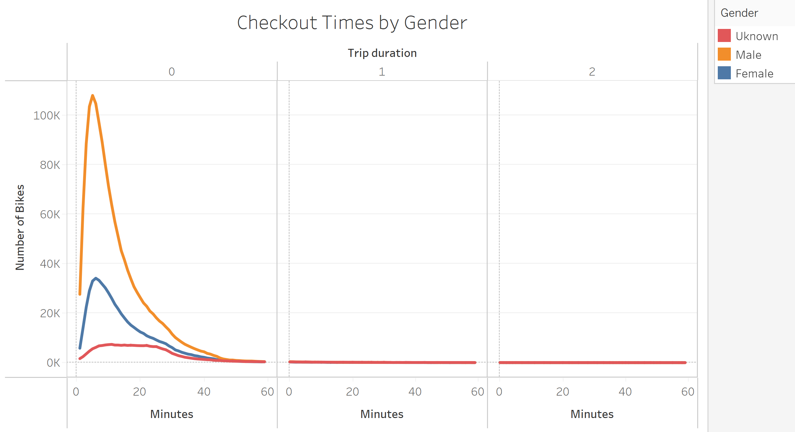

# Bike Sharing
## Overview
The purpose of this bike analysis is to provide an overview of the Citi Bike usage in NYC, which will give potential investors insight into the popularity, usage, and trends to determine if it is a lucrative investment.
[_Link to Dashboard_](https://public.tableau.com/profile/tiffany5071#!/vizhome/CitiBikeChallenge_16198025735060/Story1?publish=yes)

## Results
The visualizations below highlight different aspects of the Citi Bike data gathered.
### Checkout Times

 - This graph shows the number of bikes checked out based on the rental period; the length of rental times highlighted are: less than an hour, an hour, and two hours.  Based on the results, the most popular rental duration is approximately 10 minutes.
### Checkout Times by Gender

 - The checkout times by gender graph reveals that males are most likely to rent the bikes.  Interestingly, the most popular duration of rental is not quite consistent between males and females.  Per the graphs, it appears females tend to rent the bikes for less time, compared to males. The unknown gender category rents the bikes for a longer period of time, compared to males and females.
### Trips by Weekday

 - This heatmap reveals that the most popular times for bike rentals are Monday - Friday, between 7:00am - 9:00am and 5:00pm - 7:00pm. On the weekends, the results are opposite, where the most popular rental times are between approximately 11:00am - 5:00pm. 

### Trips by Weekday by Gender

 - This heatmap reveals that males are most likely to rent the bikes during the rush hours noted above and also during the popular weekend times.
 
### User Trips by Gender

 - This heat map highlights the usage by gender, by weekday, broken down between those distinguished as "Customers" and "Subscribers".  The data shows that male subscribers rent the majority of the bikes every day of the week, with the most popular being Thursday and Friday.  When on the Tableau story site, one can hover over each data point to reveal the rental day by user type and gender, as shown in the screen shot.

### Top Starting Locations

 - This graph highlights the most popular stations for bike rentals, which appear to be mid-town Manhattan and closer to the business district. When on the Tableau story site, one can hover over each data point to reveal the exact location, as shown in the screen shot.

### Gender Breakdown

 - This final graph reveals the breakdown by gender of the bike rental population, of which men comprise 65%.
 
## Summary
### Results
The data reveals that men are most likely to rent the Citi Bikes, for what appears to be usage during rush hour and for leisure on the weekends. There is an opportunity to increase the daily usage by females and also usage by all during the middle of the workdays, Monday - Friday.  
### Additional Recommendations
Two additional visualizations that could be brought into the analysis are: bike rental based on age and also the end station locations. The age data would be interesting to review and have a full picture of rental demographics. Regarding the end station location, it would be interesting to see how many bikes were returned to their pick-up location.
